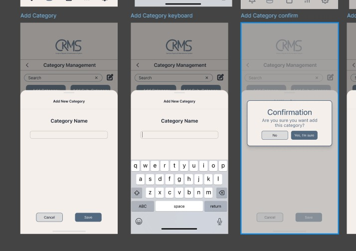
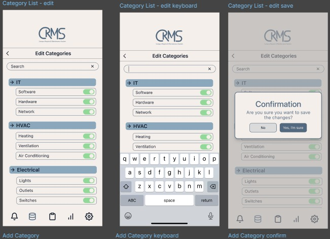
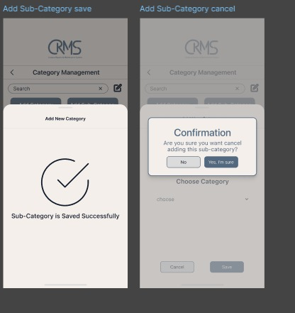

# 📱 CRM Category Management App

**IT8108 – Mobile Programming | Project Demonstration**

## 📌 Project Overview

This project is a **CRM Category Management mobile application** developed as part of the **IT8108 Mobile Programming** course. The app allows users to **manage categories and sub-categories** through a clean, user-centric interface that follows **Apple Human Interface Guidelines** and modern **UI/UX best practices**.

The application is designed for **iOS (iPhone & iPad)** using **Swift (UIKit + Storyboards)** and demonstrates real-world mobile development practices including structured architecture, responsive layouts, and professional documentation.

This project fulfills the **Project Demonstration (60%)** assessment requirements and addresses all required learning outcomes.

## 🖼️ Application Prototype 

## 🎯 Learning Outcomes Covered

* **LO1:** Design a user-centric interface following UI & UX best practices
* **LO2:** Implement a functional mobile application that meets business requirements
* **LO3:** Apply industry standards, professional coding practices, and clear documentation

## 🧩 Key Features

### Category Management
* View all categories in a structured list
* Expand/collapse categories (e.g., IT, HVAC, Electrical, Security)
* Search categories in real time

### Sub-Category Management
* Add new sub-categories under a selected category
* Edit existing sub-categories
* Enable/disable sub-categories using toggle controls

### Add / Edit Flow
* Add new categories via modal form
* Edit existing categories with inline editing
* Delete categories with confirmation dialog

## 🛠️ Technical Details

**Platform:** iOS (iPhone & iPad)  
**Language:** Swift  
**Framework:** UIKit  
**Interface Builder:** Storyboards  
**Architecture:** MVC Pattern

## 👥 Contributors

* **mahaN26**
* **MaryamTalaH05**
* **abbaskadhem Abbas**
* **44AlJamri Abbas**

## 📊 Languages
* Swift: 100.0%

